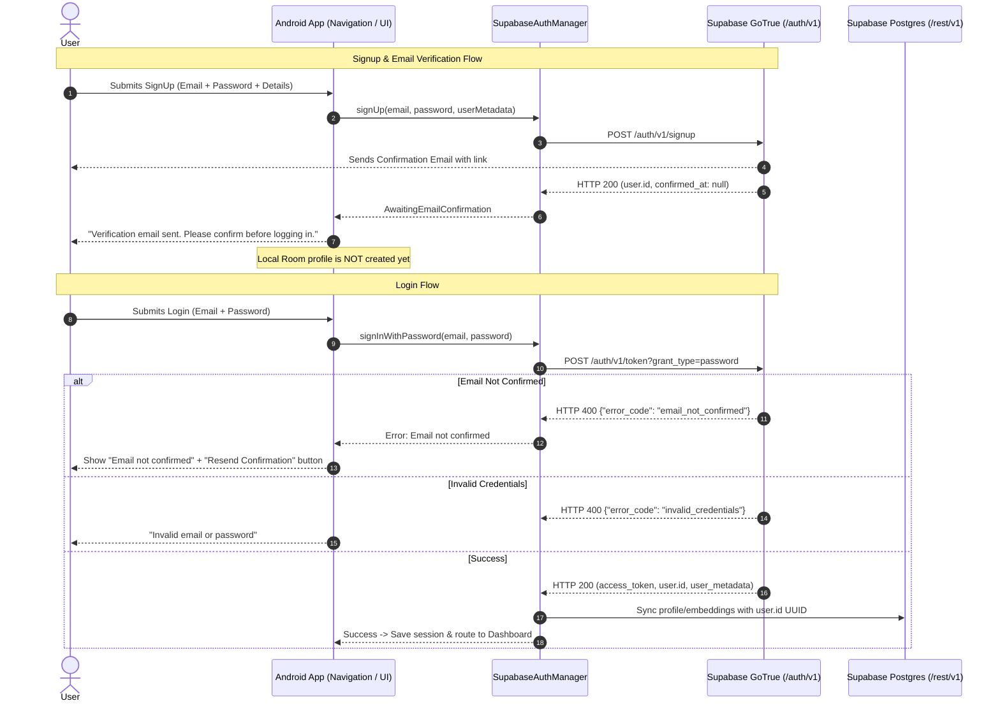

# Supabase Authentication & Biometric Threshold Verification Plan

This document details the complete technical architecture to replace the current plaintext `/rest/v1/profiles` credentials check with official **Supabase GoTrue Authentication**, implement a custom URI deep-linked password recovery flow, add teacher-assisted password resets, and establish the measurement protocol for the Stranger Test before adjusting confidence thresholds.

---

## 1. Direct Answers to Clarifying Questions

### Question 1: How Login & Multi-Device Auth Works Under the Hood Right Now
The current login and cloud fallback implementation is **100% a raw database query against the Postgres table `public.profiles` (`/rest/v1/profiles`) performing a plain string comparison**. It does **NOT** call Supabase Auth (`signInWithPassword` or `signUp`).

* **During Signup (`CloudSyncManager.registerCloudUser`):**
  The app executes a REST `POST` to `/rest/v1/profiles` and embeds the user's plain-text password into the `avatar_url` column prefixed with `pwd:`:
  ```kotlin
  val profileJson = JSONObject().apply {
      put("id", userId)
      put("email", email)
      put("full_name", fullName)
      put("role", role.uppercase())
      put("avatar_url", "pwd:${password.trim()}")
  }
  executeRequest("/rest/v1/profiles", "POST", profileJson.toString())
  ```
* **During Cloud Fallback Login (`CloudSyncManager.authenticateCloudUser`):**
  The app queries `/rest/v1/profiles?email=eq.$email&select=*`, reads `avatar_url`, strips the `pwd:` prefix, and checks `pass != cleanPassword`.
* **During Local Login (`Navigation.kt`):**
  The app queries Room DB `user.passwordHash == password`, where `passwordHash` is stored as the raw plaintext string from signup.

There are currently **no GoTrue tokens, no Supabase JWTs, no email confirmations, and no server-side password hashing** in place.

---

### Question 2: Exact Current Confidence Thresholds in `FaceMath.kt`
Straight from [`FaceMath.kt`](file:///C:/Users/Vaibhav/AndroidStudioProjects/FacialAttendanceSystem/app/src/main/java/com/vaibhav/facialattendancesystem/ml/FaceMath.kt#L6-L10):

```kotlin
enum class ConfidenceTier {
    HIGH,    // >= 0.40 Similarity (Calibrated >= 75% - Auto-Marked High Confidence)
    MEDIUM,  // 0.30 - 0.40 Similarity (Calibrated 50% - 74% - Teacher Review Needed)
    LOW      // < 0.30 Similarity (Calibrated < 50% - Unrecognized)
}
```

And in [`getConfidenceTier`](file:///C:/Users/Vaibhav/AndroidStudioProjects/FacialAttendanceSystem/app/src/main/java/com/vaibhav/facialattendancesystem/ml/FaceMath.kt#L112-L118):
```kotlin
fun getConfidenceTier(similarityScore: Float): ConfidenceTier {
    return when {
        similarityScore >= 0.40f -> ConfidenceTier.HIGH
        similarityScore >= 0.30f -> ConfidenceTier.MEDIUM
        else -> ConfidenceTier.LOW
    }
}
```

* **High Confidence (Auto-Marked):** $\ge 0.40$
* **Medium Confidence (Teacher Review):** $0.30 \le \text{score} < 0.40$
* **Low Confidence (Stranger / Unrecognized):** $< 0.30$

The thresholds compiled in the active code right now are literally **0.40** and **0.30**.

---

## 2. Proposed Changes: Supabase Auth & Password Recovery

We will implement official Supabase GoTrue Auth using direct, lightweight REST endpoints (`/auth/v1/`) without adding bulky external SDKs.



---

### Component 1: `SupabaseAuthManager.kt`
Create a dedicated authentication manager (`com.vaibhav.facialattendancesystem.data.SupabaseAuthManager`) handling:

1. **`signUp(email, password, metadata): AuthResult`**
   - Calls `POST /auth/v1/signup`.
   - Sends `email`, `password`, and `data` (`full_name`, `role`, `roll_number`, `section_or_dept`).
   - If unconfirmed (`confirmed_at == null`), returns `AuthResult.NeedsEmailConfirmation`.
   - Does **not** insert into local Room DB until email verification occurs.
2. **`signInWithPassword(email, password): AuthResult`**
   - Calls `POST /auth/v1/token?grant_type=password`.
   - Surfaces real GoTrue error codes:
     - `email_not_confirmed` $\rightarrow$ Prompts user to check inbox with a resend button.
     - `invalid_credentials` $\rightarrow$ "Invalid email or password".
     - Network/Other $\rightarrow$ Exact server message.
   - On success: extracts Supabase User UUID (`user.id`), verifies/downloads profile, and creates Room DB record keyed by that UUID.
3. **`resendVerificationEmail(email): Boolean`**
   - Calls `POST /auth/v1/resend` with `{"type": "signup", "email": email}`.
4. **`resetPasswordForEmail(email, redirectUrl): Pair<Boolean, String>`**
   - Calls `POST /auth/v1/recover` with `{"email": email, "redirect_to": "facialattendance://reset-password"}`.
5. **`updateUserPassword(recoveryAccessToken, newPassword): Pair<Boolean, String>`**
   - Calls `PUT /auth/v1/user` with `Authorization: Bearer <token>` and `{"password": newPassword}`.

---

### Component 2: Deep Linking & Password Recovery Flow

#### 1. Manifest Intent Filter (`AndroidManifest.xml`)
Register custom scheme `facialattendance://reset-password` on `MainActivity`:
```xml
<activity
    android:name=".MainActivity"
    android:exported="true"
    android:launchMode="singleTask"
    android:theme="@style/Theme.FacialAttendanceSystem"
    android:windowSoftInputMode="adjustResize">
    <intent-filter>
        <action android:name="android.intent.action.MAIN" />
        <category android:name="android.intent.category.LAUNCHER" />
    </intent-filter>
    <intent-filter android:autoVerify="true">
        <action android:name="android.intent.action.VIEW" />
        <category android:name="android.intent.category.DEFAULT" />
        <category android:name="android.intent.category.BROWSABLE" />
        <data android:scheme="facialattendance" android:host="reset-password" />
    </intent-filter>
</activity>
```

> [!IMPORTANT]
> **Action Required in Supabase Dashboard (Authentication Settings):**
> You will need to add this exact URL into your Supabase Dashboard:
> 1. Go to: **Authentication** $\rightarrow$ **URL Configuration** $\rightarrow$ **Redirect URLs**.
> 2. Add: `facialattendance://reset-password`
> 3. Click **Save**.

#### 2. Deep Link Handling in `MainActivity.kt`
- On `onCreate` and `onNewIntent`:
  ```kotlin
  val data: Uri? = intent?.data
  if (data?.scheme == "facialattendance" && data.host == "reset-password") {
      // Supabase appends tokens in fragment: #access_token=...&type=recovery
      val fragment = data.fragment ?: ""
      val params = parseFragmentParams(fragment)
      val accessToken = params["access_token"]
      val type = params["type"]
      if (type == "recovery" && !accessToken.isNullOrBlank()) {
          // Pass to Compose Navigation to route to ResetPasswordScreen
      }
  }
  ```

#### 3. Screens to Add / Modify
- **`ForgotPasswordScreen.kt` (or Dialog in `AuthScreens.kt`):**
  - "Forgot Password?" button on `LoginScreen`.
  - Enter registered email $\rightarrow$ calls `SupabaseAuthManager.resetPasswordForEmail`.
  - Informs user: *"Reset link sent to your email. Tap the link on your phone to set a new password."*
- **`ResetPasswordScreen.kt`:**
  - Opens automatically when tapping the emailed link.
  - Fields: New Password, Confirm New Password.
  - Submits via `updateUserPassword(token, newPass)`.
  - Shows success banner and returns to `LoginScreen`.

---

### Component 3: Teacher-Assisted Password Reset Fallback
- In [`ClassDetailsScreen.kt`](file:///C:/Users/Vaibhav/AndroidStudioProjects/FacialAttendanceSystem/app/src/main/java/com/vaibhav/facialattendancesystem/ui/teacher/ClassDetailsScreen.kt):
  - In the enrolled students roster, add a contextual menu or action for each student: **"Send Password Reset"**.
  - Teachers can select a student (or search by Roll Number) and trigger `resetPasswordForEmail` on the student's behalf.
  - Useful when a student forgets their password in class and needs immediate assistance.

---

## 3. Stranger Test & Confidence Threshold Verification Protocol

> [!CAUTION]
> As instructed, **zero confidence thresholds in `FaceMath.kt` will be changed** until the stranger test is completed with real measured data.

### Test Protocol
1. **Target Image:** A photo containing enrolled students (`Vaibhav`, `Aniket`) alongside 2–3 individuals not enrolled in the system.
2. **Execution:**
   - Run ML Kit Face Detection to extract chips for all individuals.
   - Run `FaceAligner.align` to produce canonical 112×112 chips.
   - Extract 512-D vectors via `FaceClassifierHelper`.
   - Execute `FaceMath.findCandidatesForFace` and log all candidate comparisons to `RecognitionLog`.
3. **Data Collection & Report:**
   - **Enrolled Matches:** Record the raw cosine similarity score between enrolled students and their stored profile.
   - **Stranger False Matches:** Record the highest raw cosine similarity score each unenrolled stranger achieved against *any* enrolled student.
   - Calculate the true distribution gap:
     $$\text{Separation Margin} = \min(\text{Enrolled Similarity}) - \max(\text{Stranger Similarity})$$
4. **Report Back:** Present the literal numbers before proposing any threshold adjustments.

---

## 4. Verification Plan

### Automated Build & Unit Verification
- Compile the complete app: `.\gradlew.bat assembleDebug`.
- Verify no compilation errors in Kotlin or navigation routes.

### End-to-End Auth Verification
1. **Signup with Email Confirmation:**
   - Sign up a new user $\rightarrow$ Verify Supabase sends email.
   - Attempt login before verification $\rightarrow$ Verify "Email not confirmed" error message and "Resend" button.
   - Verify email $\rightarrow$ Log in $\rightarrow$ Verify local Room profile is created with the Supabase UUID.
2. **Password Recovery via Deep Link:**
   - Click "Forgot Password" on login screen.
   - Submit email $\rightarrow$ Check incoming email on device.
   - Tap `facialattendance://reset-password` link $\rightarrow$ Verify app opens `ResetPasswordScreen` directly without browser dead-ends.
   - Set new password $\rightarrow$ Log in with new credentials.
3. **Teacher-Assisted Reset:**
   - In Teacher Dashboard, trigger password reset for a student by roll number $\rightarrow$ Verify recovery email is dispatched.
