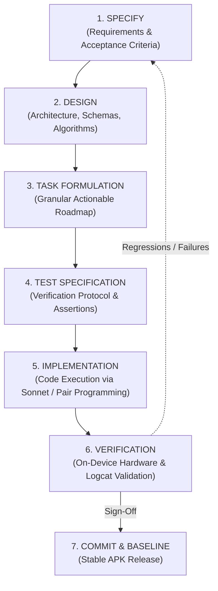

# Spec-Driven Development (SDD) — Framework & Engineering Standard
**Project:** AttendAI (Facial Attendance System)  
**Version:** 1.0.0  
**Target Platform:** Android (Kotlin 2.0, Jetpack Compose, CameraX, Room SQLite, TFLite, Supabase)  
**Standard:** Spec-Driven Development (SDD)

---

## 1. What is Spec-Driven Development (SDD)?

**Spec-Driven Development (SDD)** is a discipline where **formal specifications precede all code modifications**. The specification serves as the absolute "Single Source of Truth" (SSOT) across all engineering activities.

### Core Principles of SDD:
1. **Zero Ambiguity Before Code**: No code file is altered without an existing specification requirement ID and approved design pattern.
2. **Traceability**: Every functional requirement (`REQ-xxx`) directly maps to an architectural module (`MOD-xxx`), a concrete implementation task (`TASK-xxx`), and a verification test (`TEST-xxx`).
3. **Hardware & Physics Realism**: Because AttendAI relies on edge computer vision (sensors, lighting, face angles, distance, memory constraints), specifications must define mathematical thresholds, memory budgets, and error bounds explicitly.
4. **Offline-First Resilience**: All edge operations must function 100% autonomously on-device without requiring an active network connection; network synchronization is decoupled and strictly asynchronous.

---

## 2. SDD Documentation Suite Structure

The SDD documentation is organized into modular specifications under `docs/sdd/`:

| Document | File Name | Purpose |
|---|---|---|
| **Framework & Governance** | [`00_SDD_OVERVIEW_AND_WORKFLOW.md`](file:///C:/Users/Vaibhav/AndroidStudioProjects/FacialAttendanceSystem/docs/sdd/00_SDD_OVERVIEW_AND_WORKFLOW.md) | Methodology, roles, governance, Definition of Done (DoD). |
| **Requirements (SRS/PRD)** | [`01_SYSTEM_REQUIREMENTS_SPECIFICATION.md`](file:///C:/Users/Vaibhav/AndroidStudioProjects/FacialAttendanceSystem/docs/sdd/01_SYSTEM_REQUIREMENTS_SPECIFICATION.md) | Personas, functional requirements, non-functional performance limits. |
| **Technical Design (TDS)** | [`02_TECHNICAL_ARCHITECTURE_SPECIFICATION.md`](file:///C:/Users/Vaibhav/AndroidStudioProjects/FacialAttendanceSystem/docs/sdd/02_TECHNICAL_ARCHITECTURE_SPECIFICATION.md) | Component architecture, database schema, state management, security. |
| **Pipeline & Algorithms** | [`03_PIPELINE_AND_ALGORITHM_SPECIFICATION.md`](file:///C:/Users/Vaibhav/AndroidStudioProjects/FacialAttendanceSystem/docs/sdd/03_PIPELINE_AND_ALGORITHM_SPECIFICATION.md) | Complete 9-step biometric mathematical pipeline and calibration tiers. |
| **Roadmap & Tasks** | [`04_IMPLEMENTATION_ROADMAP_AND_TASKS.md`](file:///C:/Users/Vaibhav/AndroidStudioProjects/FacialAttendanceSystem/docs/sdd/04_IMPLEMENTATION_ROADMAP_AND_TASKS.md) | Traceability matrix and step-by-step task breakdown for changes. |
| **Verification & QA** | [`05_TEST_AND_VERIFICATION_SPECIFICATION.md`](file:///C:/Users/Vaibhav/AndroidStudioProjects/FacialAttendanceSystem/docs/sdd/05_TEST_AND_VERIFICATION_SPECIFICATION.md) | Stranger test protocol, unit tests, CameraX test gates, regression checks. |

---

## 3. The SDD Engineering Lifecycle

### Phase 1: Specification & Scoping
* **Trigger**: A new feature, enhancement, or bug fix is proposed.
* **Output**: A new requirement entry in `01_SYSTEM_REQUIREMENTS_SPECIFICATION.md` with explicit input/output contracts, user stories, and edge case definitions.

### Phase 2: Technical Architecture & Design
* **Trigger**: Approved requirement.
* **Output**: Data schema diffs, state flow diagrams, class contracts, or mathematical formulas updated in `02_TECHNICAL_ARCHITECTURE_SPECIFICATION.md` or `03_PIPELINE_AND_ALGORITHM_SPECIFICATION.md`.

### Phase 3: Task Breakdown & Traceability Mapping
* **Trigger**: Approved technical design.
* **Output**: Atomic tasks logged in `04_IMPLEMENTATION_ROADMAP_AND_TASKS.md`. Each task must identify:
  - Exact target files.
  - Dependencies on prior tasks.
  - Acceptance criteria.

### Phase 4: Implementation (Code Execution)
* **Execution**: AI Agent (Claude Sonnet / Antigravity) executes the exact task item.
* **Constraint**: Changes are restricted solely to the boundaries specified in the task item.

### Phase 5: Verification & Hardware Validation
* **Verification Protocol**:
  1. Automated Gradle compilation & KSP code generation check (`./gradlew assembleDebug`).
  2. Static analysis / lint check.
  3. Installation to physical device via ADB.
  4. Real-time Logcat capture for exceptions or runtime regressions.
  5. Photographic verification or screenshot inspection.

---

## 4. Definition of Done (DoD)

A task or feature within AttendAI is certified **DONE** if and only if all of the following conditions are met:

- [ ] **Spec Compliance**: All acceptance criteria listed in the requirement specification are satisfied.
- [ ] **Zero Compilation Warnings/Errors**: Gradle clean build completes with 0 errors.
- [ ] **Runtime Stability**: App launches and runs on the physical device with 0 crash traces in `adb logcat -b crash`.
- [ ] **Offline Operation**: The feature works without active Wi-Fi/cellular connection (local Room SQLite fallback verified).
- [ ] **Traceability Update**: Task status in `04_IMPLEMENTATION_ROADMAP_AND_TASKS.md` is updated with commit/hash or verification notes.
