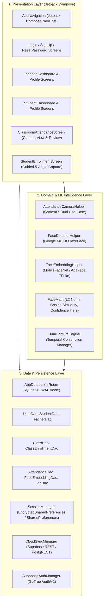
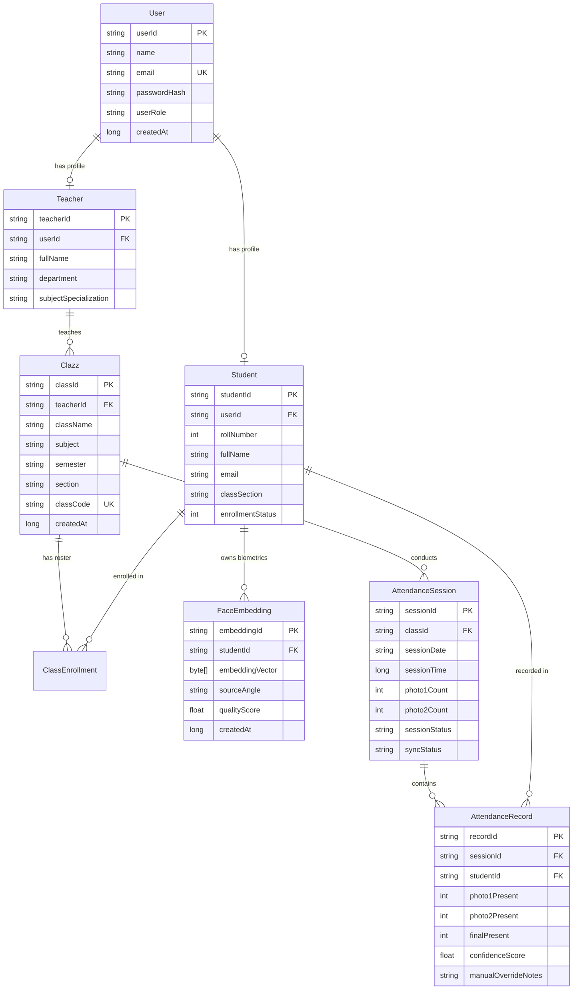

# Spec 02: Technical Architecture Specification (TDS)
**Project:** AttendAI — On-Device Biometric Classroom Attendance System  
**Document ID:** SPEC-TDS-002  
**Status:** Approved Baseline  
**Language/Runtime:** Kotlin 2.0.21 / JVM Toolchain 17 / AGP 8.13.2 / Android API 26–37  

---

## 1. System Architecture Overview

AttendAI adheres to Clean Architecture and Android's recommended Modern App Architecture (MVI / Unidirectional Data Flow) divided into three distinct layers:



---

## 2. Presentation Layer & Navigation Architecture

### 2.1 Navigation Graph & Route Safety
All screen routes are declared in a typed sealed hierarchy `Screen(val route: String)` in [`Navigation.kt`](file:///C:/Users/Vaibhav/AndroidStudioProjects/FacialAttendanceSystem/app/src/main/java/com/vaibhav/facialattendancesystem/ui/Navigation.kt).

To eliminate `IllegalArgumentException` / URI parse errors when user names or class names contain whitespace or special characters, all path parameters are sanitized through explicit URL encoding:

```kotlin
private fun encodeRouteParam(param: String): String = try {
    URLEncoder.encode(param, "UTF-8")
} catch (e: Exception) { param }

private fun decodeRouteParam(param: String): String = try {
    URLDecoder.decode(param, "UTF-8")
} catch (e: Exception) { param }
```

### 2.2 Navigation Graph Routing Matrix
| Screen Name | Route Pattern | Parameter Serialization | Target Destination |
|---|---|---|---|
| `Login` | `login` | None | Initial auth entry |
| `SignUp` | `signup` | None | Account creation |
| `ForgotPassword` | `forgot_password` | None | Password reset request |
| `ResetPassword` | `reset_password?token={token}` | URL Encoded Token | Deep link recovery entry |
| `TeacherDashboard` | `teacher_dashboard/{teacherId}/{teacherName}` | URL Encoded Name | Instructor home & class list |
| `TeacherProfile` | `teacher_profile/{teacherId}/{teacherName}` | URL Encoded Name | Instructor settings & info |
| `StudentDashboard` | `student_dashboard/{studentId}` | String ID | Student home & class list |
| `StudentProfile` | `student_profile/{studentId}` | String ID | Student settings & stats |
| `StudentEnrollment` | `student_enrollment/{studentId}/{studentName}` | URL Encoded Name | 5-step biometric enrollment |
| `ClassroomAttendance` | `classroom_attendance/{classId}/{className}` | URL Encoded Class Name | Live camera capture & review |
| `AttendanceHistory` | `attendance_history/{classId}/{className}` | URL Encoded Class Name | Historic lecture records |

---

## 3. Data & Storage Architecture

### 3.1 Local Room SQLite Schema (Database Version 6)
The local database utilizes SQLite with Write-Ahead Logging (WAL) and destructive migration fallback enabled during active development.



### 3.2 Supabase Cloud Schema Alignment
The cloud PostgreSQL database mirrors the Room schema with strict RLS:
- `public.profiles` $\leftrightarrow$ `users`, `students`, `teachers`
- `public.classes` $\leftrightarrow$ `classes`
- `public.class_enrollments` $\leftrightarrow$ `class_enrollments`
- `public.attendance_sessions` $\leftrightarrow$ `attendance_sessions`
- `public.attendance_records` $\leftrightarrow$ `attendance_records`
- `public.face_embeddings` $\leftrightarrow$ `face_embeddings` (`embedding_vector BYTEA / text base64`)

---

## 4. Hardware & Camera Subsystem (CameraX)

Camera interactions are managed by [`AttendanceCameraHelper.kt`](file:///C:/Users/Vaibhav/AndroidStudioProjects/FacialAttendanceSystem/app/src/main/java/com/vaibhav/facialattendancesystem/ui/components/AttendanceCameraHelper.kt) decoupling the live preview from high-resolution still capture:

1. **`Preview` Use-Case**:
   - Bound to Jetpack Compose `AndroidView(factory = { PreviewView(it) })`.
   - Scaled to `ScaleType.FILL_CENTER` with 60 FPS viewport rendering.
2. **`ImageAnalysis` Stream (Low Latency Overlays)**:
   - Fixed resolution: $480\times 640$ px (YUV_420_888).
   - Dedicated single-thread background executor (`analysisExecutor`).
   - Runs fast BlazeFace detection to render real-time bounding boxes and guide the teacher.
3. **`ImageCapture` Use-Case (Full Resolution Still Ingestion)**:
   - Bound with `CAPTURE_MODE_MAXIMIZE_QUALITY`.
   - Executes only upon shutter button press (`capturePhoto`).
   - Produces full optical sensor resolution ($1080p$ minimum, up to $8$–$12$ MP on Motorola g34 5G).
   - All subsequent multi-face biometric cropping, quality evaluation, and embedding extraction run on this high-resolution bitmap.

---

## 5. Security & Biometric Privacy Architecture

1. **No Raw Face Imagery in Cloud**: Raw photos are held in transient device RAM solely during crop and inference, then immediately recycled. Only abstract 192-dimensional floating-point vectors are persisted.
2. **GoTrue Auth Tokens**: JWT bearer tokens (`access_token` and `refresh_token`) are managed via [`SessionManager`](file:///C:/Users/Vaibhav/AndroidStudioProjects/FacialAttendanceSystem/app/src/main/java/com/vaibhav/facialattendancesystem/util/SessionManager.kt) and attached as `Authorization: Bearer <token>` headers to all Supabase requests.
3. **Fail-Closed Biometrics**: If an extracted face yields a quality score $< 0.5$ or falls below the stranger threshold ($< 0.30$), it is categorically rejected and never erroneously assigned.
