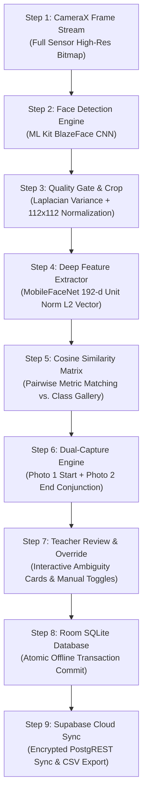

# Spec 03: Pipeline & Algorithm Specification
**Project:** AttendAI — On-Device Biometric Classroom Attendance System  
**Document ID:** SPEC-ALG-003  
**Status:** Approved Baseline  
**Mathematical Engine:** [`FaceMath.kt`](file:///C:/Users/Vaibhav/AndroidStudioProjects/FacialAttendanceSystem/app/src/main/java/com/vaibhav/facialattendancesystem/ml/FaceMath.kt)  
**Runtime Models:** Google ML Kit BlazeFace + TensorFlow Lite MobileFaceNet (192-d) / AdaFace (512-d)

---

## 1. End-to-End 9-Step Execution Pipeline

Every captured classroom frame undergoes a rigorous nine-step mathematical and architectural sequence to guarantee accurate, cheat-proof attendance recording:



---

## 2. Granular Step-by-Step Mathematical Specifications

### Step 1: CameraX Frame Ingestion (Full Sensor Capture)
- **Input**: Shutter click trigger from instructor.
- **Output**: Uncompressed ARGB_8888 Bitmap $I$ of dimensions $W \times H$ (typically $1080 \times 1920$ up to $3000 \times 4000$).
- **Configuration**:
  - `ImageCapture.CAPTURE_MODE_MAXIMIZE_QUALITY`
  - Sensor rotation normalized via EXIF orientation tags to standard upright portrait.

### Step 2: Face Detection Engine (ML Kit BlazeFace CNN)
- **Detector**: Google ML Kit BlazeFace single-shot detector.
- **Parameters**:
  - `minFaceSize = 0.02f` (allows resolving distant classroom faces down to $2\%$ of frame width).
  - `performanceMode = PERFORMANCE_MODE_ACCURATE`
  - `landmarkMode = LANDMARK_MODE_ALL`
  - `contourMode = CONTOUR_MODE_NONE`
- **Output**: Set of bounding boxes $\mathcal{B} = \{b_1, b_2, \dots, b_N\}$ where each $b_i = (x_i, y_i, w_i, h_i)$.

### Step 3: Quality Gate, Boundary Expansion & 112×112 Normalization
1. **Dynamic Padding**: To prevent facial boundary features (jawline, ears, hairline) from clipping, expand bounding box by $10\%$:
   $$\tilde{x} = \max(0, x - 0.10 \cdot w), \quad \tilde{y} = \max(0, y - 0.10 \cdot h)$$
   $$\tilde{w} = \min(W - \tilde{x}, 1.20 \cdot w), \quad \tilde{h} = \min(H - \tilde{y}, 1.20 \cdot h)$$
2. **Sharpness Assessment (Laplacian Variance)**:
   $$\text{Var}(\Delta I_{\text{crop}}) = \frac{1}{M}\sum_{u,v} (\Delta I(u,v) - \mu_{\Delta})^2$$
   - Reject if $\text{Var} < 80.0$ (excessive camera motion blur).
3. **Bilinear Spatial Resampling**:
   $$I_{112} = \text{BilinearResize}(I_{\text{crop}}, 112 \times 112)$$
   - Output normalized to tensor float format $[-1.0, 1.0]$:
   $$T(x,y,c) = \frac{I_{112}(x,y,c) - 127.5}{127.5}$$

### Step 4: Deep Feature Extraction (MobileFaceNet / AdaFace)
- **Runtime**: TensorFlow Lite C++ interpreter with GPU delegate fallback to CPU (4 threads).
- **Inference**: Passing $T_{1\times 112 \times 112 \times 3}$ produces raw output vector $\mathbf{v} \in \mathbb{R}^{192}$.
- **L2 Hypersphere Normalization**:
  To achieve identity-invariant coordinates on the unit hypersphere:
  $$\hat{\mathbf{v}} = \frac{\mathbf{v}}{\|\mathbf{v}\|_2} = \frac{\mathbf{v}}{\sqrt{\sum_{k=1}^{192} v_k^2}}$$
  $$\|\hat{\mathbf{v}}\|_2 = 1.0$$

### Step 5: Cosine Similarity Metric Matching
- **Gallery**: Enrolled class roster vectors $\mathcal{G} = \{(\mathbf{g}_j, \text{studentId}_j)\}_{j=1}^M$ where $\|\mathbf{g}_j\|_2 = 1.0$.
- **Pairwise Cosine Similarity**:
  Because both $\hat{\mathbf{v}}$ and $\mathbf{g}_j$ are unit vectors:
  $$\text{Sim}(\hat{\mathbf{v}}, \mathbf{g}_j) = \frac{\hat{\mathbf{v}} \cdot \mathbf{g}_j}{\|\hat{\mathbf{v}}\|_2 \|\mathbf{g}_j\|_2} = \sum_{k=1}^{192} \hat{v}_k \cdot g_{j,k}$$
- **Best Match Assignment**:
  $$j^* = \arg\max_{j} \text{Sim}(\hat{\mathbf{v}}, \mathbf{g}_j), \quad s^* = \max_j \text{Sim}(\hat{\mathbf{v}}, \mathbf{g}_j)$$

#### Calibrated Confidence Tiers:
| Tier | Score Range ($s^*$) | Calibrated Accuracy | System Action |
|---|---|---|---|
| **`HIGH`** | $s^* \ge 0.40$ | $\ge 75\%$ | Auto-marked **Present** |
| **`MEDIUM`** | $0.30 \le s^* < 0.40$ | $50\% - 74\%$ | Flagged for **Teacher Review** |
| **`LOW` (Stranger)** | $s^* < 0.30$ | $< 50\%$ | Rejected as **Unknown / Guest** |

### Step 6: Dual-Capture Temporal Conjunction Engine
To eliminate "attend-and-leave" proxy tactics:
- **Photo 1 ($P_1$)**: Captured within the initial 10 minutes of class.
- **Photo 2 ($P_2$)**: Captured within the closing 10 minutes of class.
- **Final Attendance Decision Function**:
  $$\text{Status}(j) = \begin{cases} 
  \text{PRESENT}, & \text{if } P_1(j) = 1 \;\land\; P_2(j) = 1 \\
  \text{INCOMPLETE (Early Left)}, & \text{if } P_1(j) = 1 \;\land\; P_2(j) = 0 \\
  \text{INCOMPLETE (Late Join)}, & \text{if } P_1(j) = 0 \;\land\; P_2(j) = 1 \\
  \text{ABSENT}, & \text{if } P_1(j) = 0 \;\land\; P_2(j) = 0
  \end{cases}$$

### Step 7: Teacher Review & Override Interface
- Draft roster rendered in Jetpack Compose.
- Instructors are presented with:
  - Verified student count.
  - Review cards showing cropped face chips for `MEDIUM` confidence or conflicting detections.
  - One-tap toggle buttons to accept or dismiss matches.

### Step 8: Room SQLite Atomic Commit
- Upon teacher confirmation, a single database transaction writes:
  - `AttendanceSession` record with session timestamps, counts, and `DRAFT` $\to$ `CONFIRMED` transition.
  - `AttendanceRecord` batch for all enrolled students in the class.
  - `sync_status = 'PENDING'`.

### Step 9: Cloud Synchronization & Export
- WorkManager checks for network availability.
- Uploads session records to Supabase via TLS 1.3 PostgREST.
- Instructor can export CSV formatted for institutional ERP:
  ```csv
  Roll Number,Student Name,Photo 1,Photo 2,Final Attendance,Confidence,Timestamp
  101,Aarav Sharma,PRESENT,PRESENT,PRESENT,0.84,2026-09-16 09:45:00
  102,Diya Patel,PRESENT,ABSENT,ABSENT,0.00,2026-09-16 09:45:00
  ```

---

## 3. Technology Stack Comparison & Insights

### BlazeFace (ML Kit) vs. YOLO
* **ML Kit BlazeFace**:
  - Optimized for ultra-fast on-device edge inference ($< 15$ ms).
  - Native Google Play Services integration (lightweight APK footprint).
  - Weakness: Small faces at classroom depth ($> 8$ meters).
  - *Mitigation*: 1080p full sensor capture, dynamic $10\%$ boundary padding, and `minFaceSize = 0.02f`.
* **YOLO (WIDER FACE)**:
  - Superior detection of dense, tiny faces in crowded auditoriums.
  - Heavier compute footprint ($150$–$300$ ms per high-res frame on mobile GPU).

### MobileFaceNet vs. AdaFace
* **MobileFaceNet**:
  - 192-dimensional vector.
  - Extremely fast ($< 25$ ms on Snapdragon 695).
  - Well-suited for standard classroom lighting and frontal/semi-profile faces.
* **AdaFace**:
  - 512-dimensional vector.
  - Quality-adaptive margin loss specifically engineered for low-resolution, degraded face crops.
  - Benchmark performance: Reduces error by $11\%$ on IJB-B and $9\%$ on IJB-C against standard baselines.
