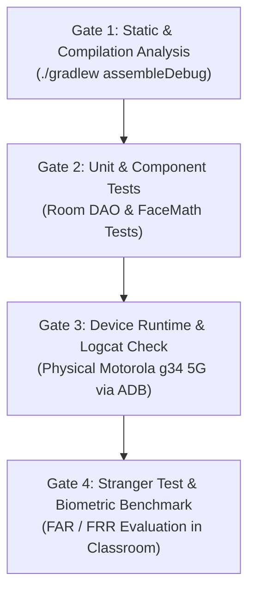

# Spec 05: Test & Verification Specification (QA Spec)
**Project:** AttendAI — On-Device Biometric Classroom Attendance System  
**Document ID:** SPEC-QA-005  
**Status:** Approved Baseline  
**Hardware Test Bed:** Motorola g34 5G (`ZA222JYJKH`), Android 14, 50MP Main Sensor  

---

## 1. Testing Hierarchy & Verification Gates

Under the SDD discipline, every code change must pass four sequential verification gates before being marked as done:



---

## 2. Gate 1: Build & Compilation Verification

### Assertions:
1. **Zero Gradle Compilation Failures**:
   ```powershell
   .\gradlew.bat clean assembleDebug
   ```
   Must exit with code `0`.
2. **KSP Code Generation**:
   Verify Room DAOs and database implementation classes (`AppDatabase_Impl.java`) are successfully synthesized.
3. **DEX Packaging Check**:
   Confirm that all application classes (specifically `MainActivity.class`) are present in the final APK DEX:
   ```python
   # Verifies MainActivity presence in classes.dex
   import zipfile
   with zipfile.ZipFile('app/build/outputs/apk/debug/app-debug.apk') as z:
       assert any(b'Lcom/vaibhav/facialattendancesystem/MainActivity;' in z.read(f) for f in z.namelist() if f.endswith('.dex'))
   ```

---

## 3. Gate 2: Biometric & Algorithm Unit Tests

### Test Cases in `FaceMathTest`:
| Test ID | Method Under Test | Scenario / Input | Expected Result |
|---|---|---|---|
| `TEST-MATH-001` | `calculateCosineSimilarity` | Identical vectors $\mathbf{u} = \mathbf{v}$ | Output $= 1.000 \pm 10^{-5}$ |
| `TEST-MATH-002` | `calculateCosineSimilarity` | Orthogonal vectors $\mathbf{u} \perp \mathbf{v}$ | Output $= 0.000 \pm 10^{-5}$ |
| `TEST-MATH-003` | `normalizeL2` | Arbitrary non-zero vector $\mathbf{v}$ | Resulting $\|\mathbf{v}\|_2 = 1.000$ |
| `TEST-MATH-004` | `getConfidenceTier` | Similarity $= 0.45$ | Returns `ConfidenceTier.HIGH` |
| `TEST-MATH-005` | `getConfidenceTier` | Similarity $= 0.35$ | Returns `ConfidenceTier.MEDIUM` |
| `TEST-MATH-006` | `getConfidenceTier` | Similarity $= 0.22$ | Returns `ConfidenceTier.LOW` |

---

## 4. Gate 3: Physical Device Runtime Verification

### Command Sequence:
1. **Install Build to Physical Device**:
   ```powershell
   & "C:\Users\Vaibhav\AppData\Local\Android\Sdk\platform-tools\adb.exe" install -r app\build\outputs\apk\debug\app-debug.apk
   ```
2. **Clear Crash Buffer & Start Activity**:
   ```powershell
   & "C:\Users\Vaibhav\AppData\Local\Android\Sdk\platform-tools\adb.exe" logcat -c
   & "C:\Users\Vaibhav\AppData\Local\Android\Sdk\platform-tools\adb.exe" shell am start -n com.vaibhav.facialattendancesystem/.MainActivity
   ```
3. **Verify Zero Runtime Crashes**:
   ```powershell
   & "C:\Users\Vaibhav\AppData\Local\Android\Sdk\platform-tools\adb.exe" logcat -d -b crash
   ```
   Must return an empty output buffer.

---

## 5. Gate 4: The Stranger Test Protocol (Classroom Biometric Benchmark)

The **Stranger Test** is the gold-standard field test to ensure that AttendAI does not falsely mark un-enrolled students as present (False Acceptance).

### 5.1 Test Setup
1. **Enrolled Gallery ($\mathcal{G}$)**: Enroll 3–5 real students using the guided 5-step enrollment flow.
2. **Strangers ($\mathcal{S}$)**: Gather 3–5 individuals who are **NOT** registered in the class database.
3. **Classroom Environment**: Standard university lecture room with overhead fluorescent lighting.

### 5.2 Test Execution Sequence
1. The instructor initiates a new attendance session for the class.
2. **Test Run A (Enrolled Students Only)**:
   - Capture classroom photo.
   - Record: Number of detected faces, similarity scores $s_i$ for each enrolled student.
   - *Target*: All enrolled students should achieve $s_i \ge 0.40$ (High Confidence).
3. **Test Run B (Strangers Only)**:
   - Have the 3–5 unregistered individuals stand in the classroom.
   - Capture photo.
   - Record: Highest similarity score $s_{\text{max}}$ produced by matching their embeddings against the class gallery.
   - *Target*: All stranger matches must yield $s_{\text{max}} < 0.30$ (Categorized as Low/Stranger).
4. **Test Run C (Mixed Classroom)**:
   - Enrolled students and strangers seated together.
   - Capture photo.
   - Verify: Enrolled students receive auto-present ticks; strangers appear as unassigned or are excluded from the roster.

### 5.3 Acceptance Criteria & Threshold Adjustment Rule
- **Condition 1 (Safe Separation)**:
  $$\min_{i \in \text{Enrolled}} s_i > \max_{k \in \text{Strangers}} s_k$$
  A clean gap of at least $0.10$ must exist between the lowest enrolled score and the highest stranger score.
- **Adjustment Action**:
  - If a stranger ever scores $\ge 0.40$, immediately raise the High Confidence threshold in `FaceMath.kt` from $0.40$ to $0.45$ or $0.50$.
  - If enrolled students at classroom distance score $0.32$–$0.38$, retain Medium Confidence with faculty review card.

---

## 6. Regression Test Checklist

Before any PR or release is tagged:
- [ ] Navigation backstack preserves login state and does not create duplicate Activities.
- [ ] Logout clears session tokens from `SessionManager` and redirects to `Login`.
- [ ] Airplane mode test: App launches, views cached classes, records offline attendance session to Room DB without crash.
- [ ] Camera permission re-prompt: Denying camera permission displays rationale without freezing UI.
- [ ] CSV export file creates valid UTF-8 file in device storage and triggers standard Android Share sheet.
